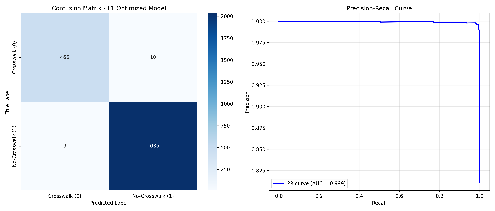
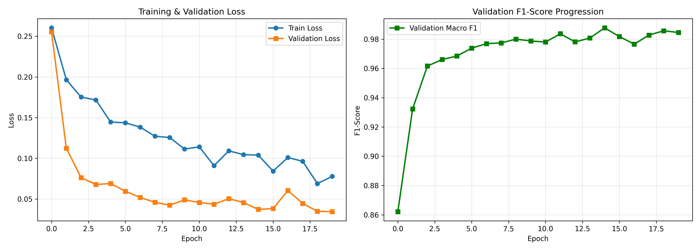

# 🎯 CDS Crosswalk Classifier

Welcome to the CDS Crosswalk Classifier project! This is a complete, production-ready Deep Learning pipeline for detecting crosswalks (Fussgängerstreifen) in satellite images using PyTorch.

This README reflects the current state of the repository, including data preparation, model architecture, training, and evaluation.

---

## 🚀 Environment Setup

This project uses **Poetry** to manage dependencies. For detailed environment setup instructions, please see `POETRY_SETUP.md`.

### Quick Start
1. **Install Poetry** (if not installed):
   ```bash
   pip install poetry
   ```
2. **Install Dependencies**:
   ```bash
   poetry install
   ```
   *(Note: This project requires Python 3.12+ and installs the CUDA 11.8 version of PyTorch for GPU acceleration).*
3. **Activate the Environment**:
   ```bash
   poetry shell
   ```

---

## 🗂️ Data Preparation & Utilities

The project includes several utilities to prepare, clean, and analyze the dataset before and after training. These are all located in the `tools/` directory:

- `tools/sort_images.py` & `tools/copy_img.py`: Utilities to organize and manage raw image files.
- `tools/reclassify_images_ui.py`: A UI tool that lets the user manually review and reclassify wrongly classified images (Human-in-the-Loop).
- `tools/rebalance_dataset.py`: Handles class imbalances in the training data to prevent biased models.
- `tools/data_split.py`: Splits the data into robust training (70%), validation (15%), and testing (15%) sets.
- `tools/augment.py`: Contains specific data augmentation logic for PyTorch dataloaders.

To prepare your dataset, place your images in the `data/` directory and run the relevant scripts (e.g., `python tools/data_split.py`).

---

## 🧠 Model Architecture (`model.py`)

The architecture uses a pretrained **ResNet18** backbone paired with a custom classification head designed to mitigate overfitting while learning the specific features of crosswalks.

### Architecture Flow:
```text
Input (3, 224, 224)
    ↓
ResNet18 Backbone (Fine-tuned/Unfrozen by default)
    ├─ Conv1 (3 → 64 channels)
    ├─ Layer1-4 (residual blocks)
    └─ Global Average Pooling → (512,)
    ↓
Custom Classification Head
    ├─ FC1: 512 → 256
    ├─ BatchNorm1d → ReLU → Dropout(0.4)
    ├─ FC2: 256 → 2 (logits)
    ↓
Output: [logits for "crosswalk", "no-crosswalk"]
```

**Key Features:**
- **2-Layer Custom Head**: Simplified from earlier iterations to prevent overfitting.
- **Fine-Tuned Backbone**: The ResNet18 backbone is unfrozen, allowing it to adapt deeply to satellite imagery.
- **Class Weights**: The loss function (`CrossEntropyLoss`) applies softened weights (e.g., `[15.0, 1.0]`) to prioritize minority classes (crosswalks) and balance Precision vs. Recall.

---

## 🏋️‍♂️ Training (`train.py`)

To begin training the model:

```bash
python train.py
```

**Training Details:**
- Uses the **Adam** optimizer with weight decay.
- Employs a **ReduceLROnPlateau** scheduler that monitors the **maximum F1-score** on the validation set, reducing the learning rate by 50% if the F1-score plateaus.
- Automatically saves model weights to the `checkpoints/` directory.
- Training metrics are logged to `training_history.json`.

---

## 📊 Evaluation & Error Analysis

### Standard Evaluation (`evaluate.py`)
To evaluate a trained model checkpoint:

```bash
python evaluate.py
```

This script generates extensive metrics and plots saved directly to the `eval/` folder (or subfolders for specific models):
- `confusion_matrix.png`: Heatmap of True/False Positives/Negatives.
- `roc_curve.png`: Receiver Operating Characteristic curve and AUC score.
- `training_curves.png`: Loss and F1-score progression over epochs.
- `evaluation_metrics.json`: Final numerical metrics (F1, Precision, Recall, Accuracy).

### Find Misclassified Images (`tools/find_misclassified_images.py`)
To deeply understand where the model struggles:
```bash
python tools/find_misclassified_images.py
```
This generates an `eval/misclassified_images.csv` to review false positives and false negatives, which interfaces with manual verification pipelines (`data/meta/review_queue.json`, `data/meta/verified_labels.json`).

---

## 🔬 Hyperparameter Tuning (`hyperparameter_tuning.py`)

To find the optimal settings for your model, we use **Optuna**.

```bash
python hyperparameter_tuning.py
```

Optuna will run multiple trials using Bayesian optimization to find the best combination of:
- Learning rate
- Dropout rate
- Batch size
- Weight decay

The best configuration is automatically saved to `best_optuna_params.json`.

---

## 📈 Expected Results & Model Performance

The current baseline model (`model_F1_09877`) achieves outstanding performance on the test set, demonstrating high reliability in identifying crosswalks despite the class imbalance.

> **Note on Hyperparameter Tuning:** The current model could perform even better, but lengthy hyperparameter tuning resulted in the PC crashing many times. All tuning was calculated locally with great speed and efficiency due to wanting to test personal hardware instead of FHGR hardware. In the future, this will be done on FHGR servers to avoid these crashes caused by Windows and driver issues.

**Key Performance Metrics:**
- **Accuracy:** 99.25%
- **F1-Score (Macro):** 98.77%
- **Precision (Crosswalk):** 98.11%
- **Recall (Crosswalk):** 97.90%
- **PR AUC:** 99.90%

**Per-Class Accuracy:**
- **Crosswalk (0):** 97.90%
- **No-Crosswalk (1):** 99.56%

### Visual Diagnostics

<div align="center">
  
  
</div>

---

## 🐛 Troubleshooting

- **GPU Not Available:** Ensure you have the CUDA 11.8 toolkit installed. Check compatibility with `python -c "import torch; print(torch.cuda.is_available())"`.
- **Out of Memory (OOM):** Reduce the batch size in your scripts or close background applications consuming VRAM.
- **Poor F1-Score:** Consider re-running `tools/rebalance_dataset.py` or tuning the class weights in `train.py`. Use `tools/find_misclassified_images.py` to check for systematically mislabeled data.

---

## 🙌 Acknowledgments & Credits

- **AI Assistance:** This project was heavily vibe coded and assisted through AI.
- **Dataset Collection:** The dataset was gathered using [swissimage_annotator](https://github.com/sudoale/swissimage_annotator) and in cooperation with Fabian Nadler, Frederic Kurbel, Joel Hallauer, Lars Cools, Mike Obrietan, and Neel Frei.

---

## 🤝 Contributing

Contributions to improve the dataset, model architecture, or data processing tools are always welcome!

1. Fork the Project
2. Create your Feature Branch (`git checkout -b feature/AmazingFeature`)
3. Commit your Changes (`git commit -m 'Add some AmazingFeature'`)
4. Push to the Branch (`git push origin feature/AmazingFeature`)
5. Open a Pull Request

---

## 📄 License

Distributed under the MIT License.
